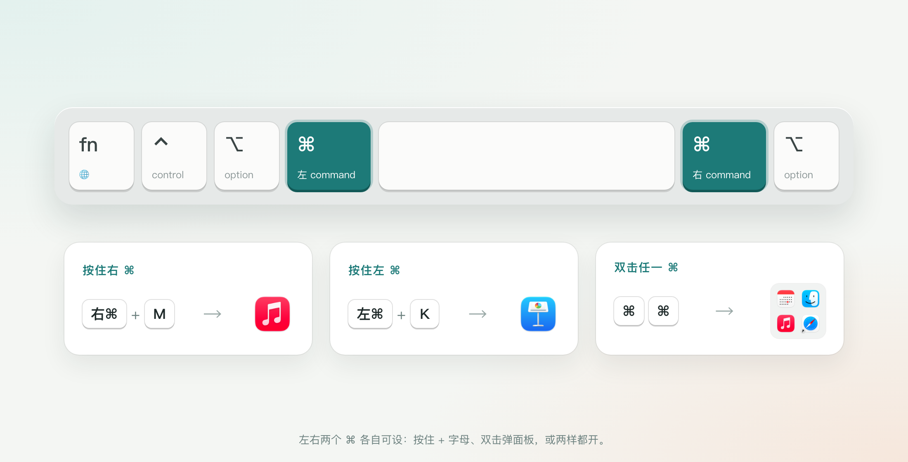

# Initials · 一个键切到任何 app

**中文** | [English](README_EN.md)

[官网、下载与安装教程](https://initials.tianli.cyou/) · [English website](https://initials.tianli.cyou/en/)

按住 **⌘** 再按字母，瞬间切到、打开或隐藏对应的 app；快速**双击 ⌘**，弹出字母面板，再按字母切换。左右两个 ⌘ 各自可设，可以同时用。原生 macOS（Swift + AppKit），常驻菜单栏，附带同源 `initials` 命令行（给脚本和 agent 用）；实测占用见[资源占用](#资源占用)。



<!-- lightweight:start -->
## 资源占用

| 安装包 | 空闲内存 | 空闲 CPU | 冷启动到首屏就绪 |
|---|---|---|---|
| **2.3 MB**（装好后 3.2 MB） | **16.8 MB** | **0%** | **151 ms** |

纯 AppKit，零第三方依赖；按键由系统事件回调送达，回调里只做几次比较，切换动作放到回调外执行；配置改动由 kqueue 通知、不轮询，仅每 30 秒确认一次按键监听仍开着。

<sub>v1.3.1 (10) · Mac16,12 / Apple M4 / macOS 27.2 · 运行数据（空闲、就绪冷启动、字母面板）实测自本机装机的本地验收构建 1.3.1 (10)，构建回执已核对当前源码；下载大小取现有公开包 1.3.1 (8) 的 DMG。 · 2026-10-07。数字来自所列设备实测，版本更新后重新测量。内存口径为 phys_footprint；CPU 为 60 秒采样窗内 CPU 时间 ÷ 墙钟；大小按十进制 MB。原始数据见 [perf/lightweight.json](perf/lightweight.json)。</sub>
<!-- lightweight:end -->

## 用法

左右两个 ⌘ 各有两个开关，可以只开一个，也可以都开。默认：右 ⌘ 按住，左 ⌘ 双击。

- **按住 ⌘ + 字母**：
  - 指定了 app 的字母：没开就启动，开着就切过去；已在最前就隐藏，再按一次切回来。
  - 右 ⌘ 没指定的字母：在名字以它开头、正在运行的 app 之间轮换。
  - 左 ⌘ 只接管字母表里指定过的字母，⌘C、⌘V 等照常；如果指定的字母占了常用快捷键，设置窗和 `initials list` 会提示。
  - 同时按 ⇧⌥⌃ 的组合照常放行；两个 ⌘ 同时按住时以右 ⌘ 为准。
- **双击 ⌘，再按字母**：屏幕中间弹出这一边的字母面板，不抢当前窗口焦点；Esc 或 4 秒不按键自动关闭。两下之间按了别的键、点了鼠标、按住太久或左右各按一下都不算双击。
- 左右各有一张字母表；默认左边沿用右边的表，可以在设置里分开。
- **设置**（菜单栏 ⌘ 图标 → 设置）：⌘1/⌘2 切换右 ⌘ / 左 ⌘，⌘N 添加，⌫ 移除，↩ 换 app，⌘W 关闭。可一键“从 Hammerspoon 导入”已有的 right_command 映射；旧版 MacKit 仍带 rcmd 模块时，设置窗还会提供“关闭 Hammerspoon rcmd”。

## 安装

需要 macOS 14+，Apple Silicon。

1. 打开 DMG，把 Initials 拖到“应用程序”，从“应用程序”打开。安装包使用 Developer ID 签名并经 Apple 公证。
2. 在设置窗口点“打开辅助功能设置…”，在“系统设置 › 隐私与安全性 › 辅助功能”里打开 Initials。顶部显示“✓ 已授权辅助功能，正在工作”即可，不用重启。Initials 只看 ⌘ 和紧跟的字母，不记录、不保存输入。
3. 点“添加…”给字母指定 app，或“导入配置…”。选择开启配置同步后，已开启 iCloud Drive 的同一 Apple ID 会沿用已有配置，也可以“从 Hammerspoon 导入”。

## 配置同步与备份

在设置里选择“通过 iCloud Drive 自动同步配置”，即可跟随系统 Apple ID 记住两侧字母表、触发方式、隐藏/轮换开关和时间参数。新安装默认关闭，由你选择开启；已有同步开关会保留。两台 Mac 使用同一 Apple ID、开启 iCloud Drive，并在 Initials 中选择同步。配置保存在 iCloud Drive 的 `Initials/config.json`，传输由 macOS 完成；离线仍用本机配置，联网后同步。新机器的空配置不会覆盖云端；两台离线修改不同字母会合并，同一字母同时修改时本机尚未同步的改动优先。

手动迁移：旧 Mac 在设置点“导出配置…”，把生成的 `Initials-config.json` 传到新 Mac，在设置点“导入配置…”。导入恢复完整配置，未安装的 App 保留对应字母；按 bundle ID 查找本机应用位置。导入前的配置保存在本机配置目录的 `config-before-import.json`；无效文件不会覆盖现有配置。辅助功能授权、“登录时打开”和暂停状态由每台 Mac 单独管理。

```bash
initials export ~/Initials-config.json
initials import ~/Initials-config.json --dry-run --json
initials import ~/Initials-config.json
initials sync status --json
initials sync off                 # 本机关闭同步，保留两边的配置
initials sync on
initials sync now                 # 立即核对本机与 iCloud Drive 文件；云端传输由系统完成
```

只同步你选择的 App 和快捷键设置，不记录键盘输入。iCloud 同步使用你自己的 Apple ID；切换应用本身不需要联网。

菜单栏和设置都有“检查更新…”：读取官网的实际发行版本，有新版可在窗口内升级。安装包经过 SHA256、App 身份和开发者签名校验，替换失败保留旧版，配置不变。脚本可用 `initials updates --json` 只读检查；断网或发行记录无效会明确报错。有新版时 `initials update install --yes` 走窗口里“升级到新版…”的同一条路（先加 `--dry-run` 只看会做什么）。

## 命令行（给脚本与 agent）

图形界面给人用，`initials` 给脚本和 agent 用。两者调用同一套 `Sources/Shared` 业务代码、改同一份配置，校验规则一致（例如左 ⌘ 沿用右 ⌘ 字母时不能编辑左边的表），运行中的 app 立即生效。命令装在 `Initials.app/Contents/Resources/bin/initials`，`scripts/install.sh` 链到 `~/.local/bin/initials`。

- 每个命令都有 `initials <命令> --help`：只打印说明，不执行任何动作。
- 每个命令都支持 `--json`：输出一个带 `"ok"` 的对象；失败时 `"ok": false`、带 `error`，退出码非 0。帮助加 `--json` 也是一个对象（`{"ok": true, "command", "help"}`）。
- 改配置的命令都支持 `--dry-run`：输出改后的结果，不保存；结果与原配置相同时不重写文件。
- 未知参数一律以退出码 2 拒绝，不会被忽略后误执行。

```bash
# 读取（不写任何文件）
initials list [--side right|left] [--json]   # 两边的触发方式、选项、快捷键冲突、字母表（含 app 是否找得到、实际位置）
initials preview [字母…] [--side right|left] [--json]  # 每个字母此刻会做什么（打开/切换/隐藏/无），只报告不执行
initials status [--json]         # 是否运行、辅助功能授权、是否拦截、是否暂停、是否生效
initials login [--json]          # 是否“登录时打开”（不带 on|off 时只读）
initials path [--json]           # 配置与状态文件位置
initials version [--json]        # 所在 Initials.app 的版本

# 修改配置（都可加 --dry-run、--json）
initials set m Music             # 名字、bundle id 或 /路径/To.app
initials set w WeChat --side left  # 左边单独设（先 initials share off）
initials unset m
initials move m k                # 把 M 的 app 移到 K（覆盖 K 原有的 app，并在结果里注明）
initials export 文件.json        # 导出完整配置（也支持 --dry-run）
initials import 文件.json        # 导入完整配置并备份；没装的 app 保留
initials import [--from keymaps.lua]  # 导入 Hammerspoon right_command，没装的 app 跳过并列出
initials hold on|off [--side right|left]        # 按住该 ⌘ + 字母
initials tap on|off [--side right|left]         # 双击该 ⌘ 弹面板
initials cycle on|off [--side right|left]       # 没指定的字母在名字以它开头的运行中 app 之间轮换
initials hide-front on|off [--side right|left]  # 该 app 已在最前时再按就隐藏
initials share on|off            # 左 ⌘ 沿用右 ⌘ 的字母（左边自己的表会保留）
initials enable|disable [right|left|all]  # 写进配置，重启后仍有效

# 运行中的 app 与外部模块（可加 --json；不改 Initials 配置，不接受 --dry-run）
initials pause | resume          # 同菜单栏“暂停/恢复”，只在本次运行有效；先用 status 看当前状态
initials quit [--dry-run]        # 同菜单栏“退出”；再启动：open -g -j -a Initials --args --background
initials login on|off [--dry-run]  # 同设置窗“登录时打开 Initials”，由所在的 Initials.app 向系统登记，结果按系统回读
initials hammerspoon rcmd on|off # 只在旧版 MacKit 仍带 rcmd 模块时可用

# 版本更新（“配置与更新”窗口的同一套检查与安装；--json 的失败是 {"ok": false, "command", "error": {"code", "message"}}，见 initials update --help）
initials update check            # 只读：当前版本、官网最新版本、有没有新版、怎么升级
initials update install --yes [--dry-run]  # 同窗口“升级到新版…”：校验 SHA256、App 身份和开发者签名后替换所在的 Initials.app，运行中的先退出再重开，旧版进废纸篓；没有新版时不做任何事、退出 0
```

给 agent 的典型用法：

```bash
initials list --json | jq '.right.bindings | map_values(.found)'   # 哪些字母的 app 找不到
initials set m Music --dry-run --json                               # 先看改动，再去掉 --dry-run 执行
initials preview m s --json | jq '.letters[] | {letter, action, target}'
initials pause --json && initials status --json | jq '{paused, intercepting, active}'
```

退出码：0 成功；1 没找到（字母、app、导入文件不存在或其中没有 right_command 字母、rcmd 模块）；2 用法错误或无法读写（含左 ⌘ 沿用右 ⌘ 字母时编辑左边）；3 Initials 没在运行（status、pause、resume、quit）；4 运行中的 app 没有确认（pause、resume、quit，早于该功能的 app 版本会这样）。`initials --help` 列出读命令与写命令、`--json` 的输出形状、退出码表和只在窗口里的项。`status` 读取 app 写的 `status.json` 并核对进程确实是 Initials：启动、授予辅助功能、暂停/恢复时立即写入；辅助功能被撤销或拦截失效，由已有的 30 秒看门狗发现后改写（只在状态变了时写，不另设定时器），所以这类变化最多晚 30 秒。

覆盖范围：设置窗里的全部开关、字母表的添加、更换、移动、移除与导入，菜单栏的暂停/恢复和状态，字母面板的内容（`preview`）都有对应命令。只留在图形界面：选 app 的对话框和图标、⌘1/⌘2 等窗口操作、申请辅助功能授权（只能由 app 自己请求，并由用户在系统设置里打开）、切换“登录时打开”（macOS 要求 app 自己注册，CLI 只读）、退出 app。按键切换本身也不做成命令：真的切换会抢走当前焦点；想知道字母会做什么用 `preview`，要切到某个 app 用 `open -a`。

配置在 `~/Library/Application Support/cyou.tianli.initials/config.json`，app 会监视文件，改动即时生效；`INITIALS_SUPPORT_DIR=<目录>` 让 app 和 CLI 都改用该目录，测试时不碰真实配置。装有 [MacKit](https://github.com/zengtianli/mackit) 时，当前字母会写入 `~/.config/mackit/keys.d/initials.json`，`mackit keys` / `mackit doctor` 可查到并检查冲突。

## 实测

[资源占用](#资源占用)区块由 [perf/lightweight.json](perf/lightweight.json) 自动生成，列出安装包、空闲内存、CPU 与启动速度及其测量版本和条件。`build.sh` 另含按键判断基准；切换动作放到拦截回调外执行。

## 构建

```bash
bash build.sh               # 先跑单元测试，再编译 app 与 CLI、签名 → build/Initials.app
INITIALS_BUILD_DIR=build/dev CODESIGN_IDENTITY=- bash build.sh  # 自用开发构建，不动发布用的 build/Initials.app
bash scripts/install.sh     # 退出 Initials 后安装到 /Applications，CLI 链到 ~/.local/bin
bash scripts/install.sh --restart  # Initials 正在运行时：退出、安装，再在后台重启（不抢焦点）
python3 scripts/release.py  # 公证 app 与 DMG 并装订，写 build/release.json
python3 scripts/shots.py    # 从构建出的 app 重新生成 site/assets 截图与场景图
python3 scripts/build-site.py  # 用 release.json 生成 build/site（主页 + 下载）
```

界面验证不抢焦点：`Initials --snapshot out.png --settings right|left [--dark]`、`--snapshot out.png --picker [--right]` 离屏渲染；`Initials --simulate right:m,left:s` 只打印每个字母此刻会做什么，不执行。`Initials --help` 列出 app 本体的全部参数，不认识的参数直接退出；同一个配置目录已有一份 Initials 在运行（以该目录的 `status.json` 为准）时，第二份不会启动；隔离目录里的自测进程和 `--snapshot` 渲染不会挡住正式 app 启动。测试隔离用 `INITIALS_SUPPORT_DIR=<目录>`；`scripts/accept/*.py` 用隔离目录验收 CLI、暂停通道（`--control-self-test`）和离屏界面。

## 许可

MIT。
